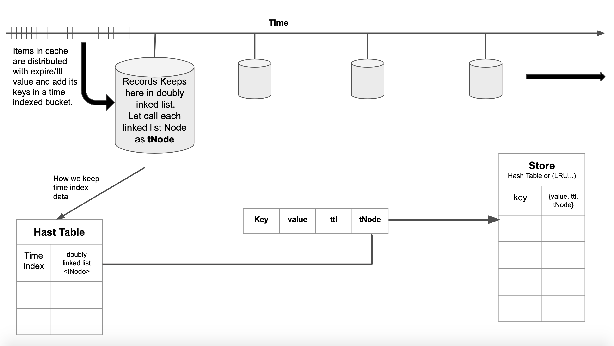

# TTL cache engine Architecture

One of the challenges on ttl cache replacement is to clean the expired items. For smart cleaning, when we add new item it will time partitioned by ttl/expired value and put it into a time corresponded bucket.  
Whenever a get method called it check the element exist and check it is expired or not. If it is expired then removes the item and clean previous buckets.  
There is also a `runGC()` method in ttl cache. It will clean the buckets in between last cleaned time and now.  
TTL engine do not run `runGC()` method automatically or in an interval.   
We do not need to iterate or look all items for cleaning because of expired time partitioning. check below image for more information of architecture.

